# Architecture Diagrams

This document contains visual architecture diagrams for the Liquor Marketing Agent application.

---

## System Architecture Overview

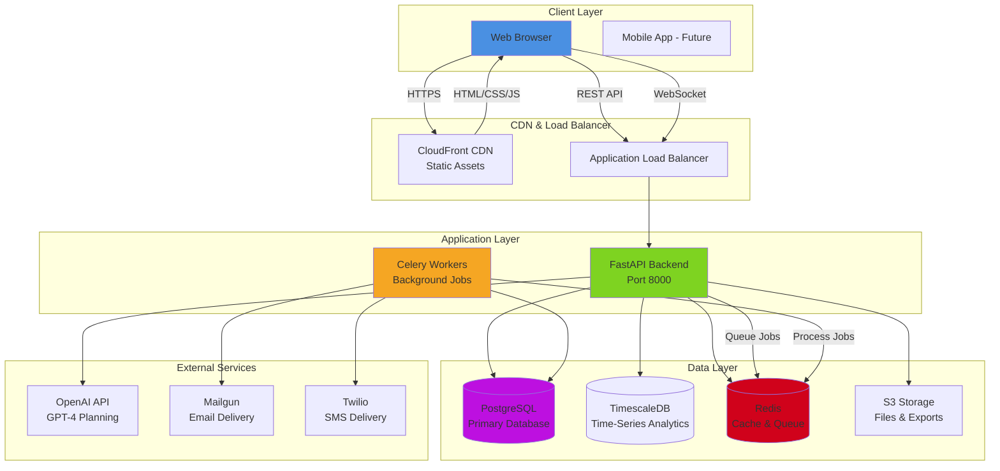

---

## Backend Service Architecture

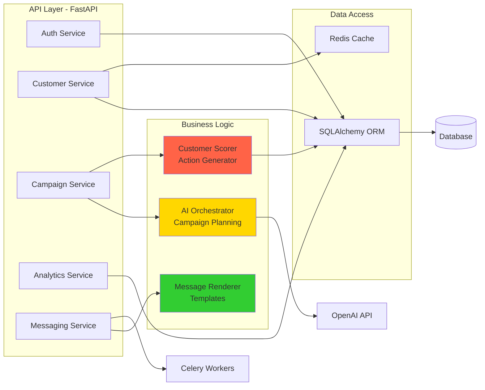

---

## Frontend Architecture

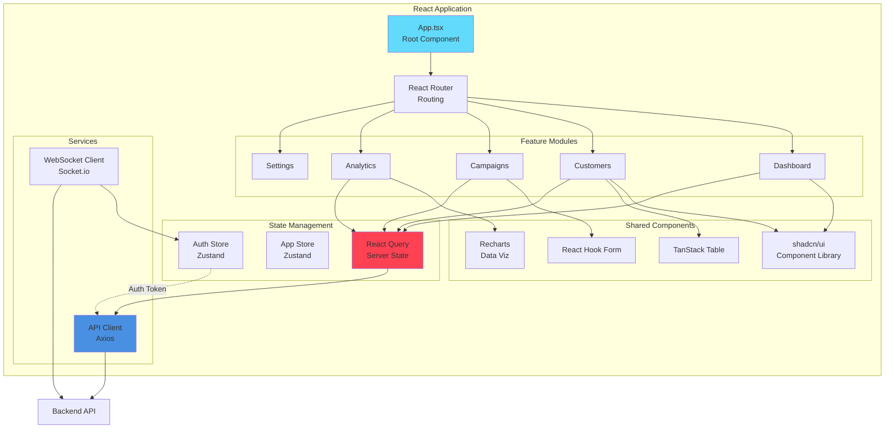

---

## Data Flow - Campaign Creation

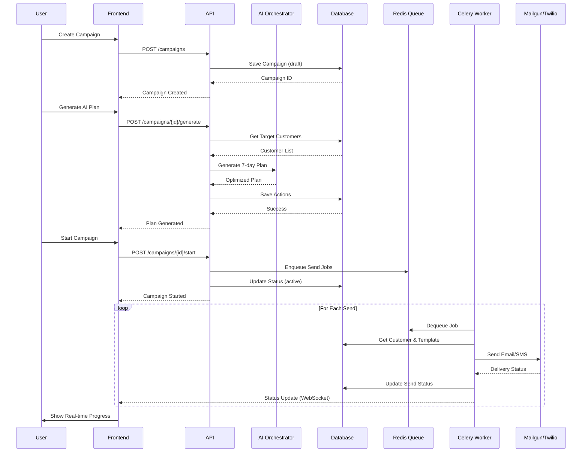

---

## Database Schema (Entity Relationship)

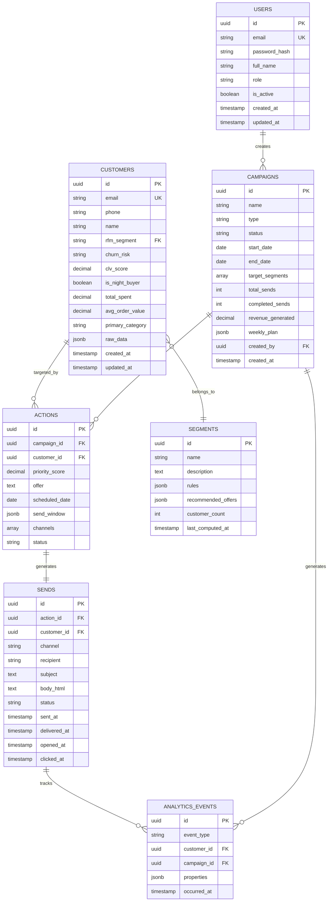

---

## Deployment Architecture (AWS)

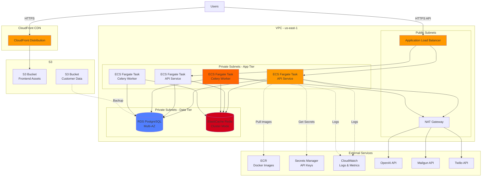

---

## Message Sending Flow

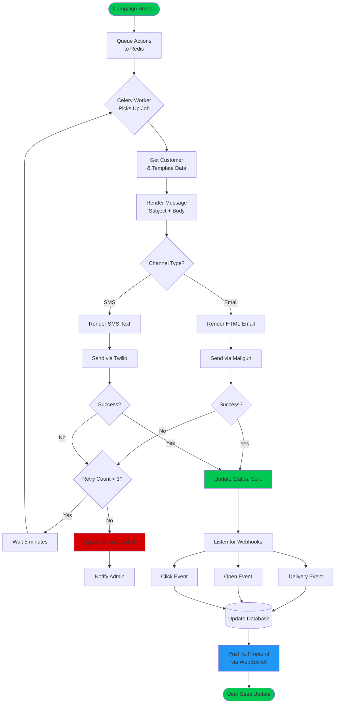

---

## AI Campaign Planning Flow

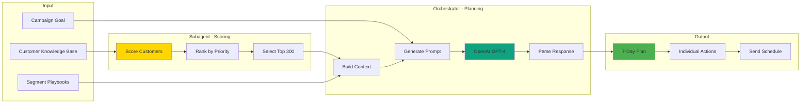

---

## Security Architecture

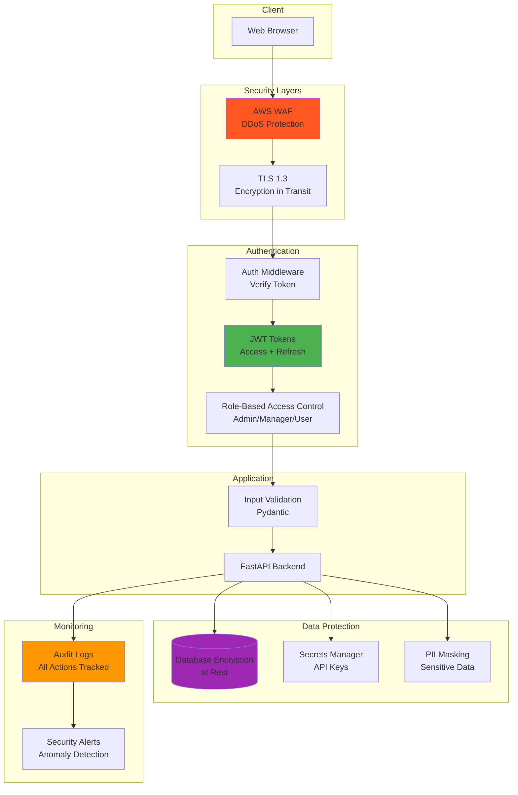

---

## Monitoring & Observability

```mermaid
graph TB
    subgraph "Application"
        API[FastAPI Backend]
        Worker[Celery Workers]
        Frontend[React Frontend]
    end
    
    subgraph "Metrics Collection"
        Prometheus[Prometheus]
        CloudWatch[CloudWatch Metrics]
    end
    
    subgraph "Logging"
        AppLogs[Application Logs<br/>Structured JSON]
        AccessLogs[Access Logs<br/>ALB]
        ErrorLogs[Error Logs<br/>Sentry]
    end
    
    subgraph "Tracing"
        OpenTelemetry[OpenTelemetry]
        Jaeger[Jaeger<br/>Distributed Tracing]
    end
    
    subgraph "Visualization"
        Grafana[Grafana Dashboards]
        Kibana[Kibana<br/>Log Analysis]
        Sentry[Sentry<br/>Error Tracking]
    end
    
    subgraph "Alerting"
        PagerDuty[PagerDuty]
        Slack[Slack Notifications]
    end
    
    API --> Prometheus
    API --> AppLogs
    API --> OpenTelemetry
    Worker --> AppLogs
    Frontend --> ErrorLogs
    
    Prometheus --> Grafana
    AppLogs --> Kibana
    OpenTelemetry --> Jaeger
    
    API --> CloudWatch
    CloudWatch --> Grafana
    
    ErrorLogs --> Sentry
    Sentry --> PagerDuty
    CloudWatch --> Slack
    
    style API fill:#7ED321
    style Grafana fill:#F46800
    style Sentry fill:#362D59
    style PagerDuty fill:#06AC38
```

---

## Development Workflow

```mermaid
flowchart LR
    Dev[Developer] -->|Write Code| Local[Local Development]
    Local -->|Commit| Git[Git Branch]
    Git -->|Push| GitHub[GitHub]
    
    GitHub -->|Trigger| CI[GitHub Actions<br/>CI Pipeline]
    
    CI --> Lint[Run Linters]
    CI --> Test[Run Tests]
    CI --> Build[Build Docker Images]
    
    Test -->|Pass| Build
    Lint -->|Pass| Build
    
    Build -->|Push| ECR[ECR Registry]
    
    Build -->|Success| PR[Pull Request Review]
    PR -->|Approved| Merge[Merge to Main]
    
    Merge -->|Auto Deploy| Staging[Staging Environment]
    
    Staging -->|QA Pass| Approval[Manual Approval]
    Approval -->|Deploy| Prod[Production Environment]
    
    Prod -->|Monitor| Monitoring[Monitoring & Alerts]
    
    style Dev fill:#4A90E2
    style CI fill:#00C853
    style PR fill:#FF9800
    style Prod fill:#D50000
```

---

**Legend:**
- 🟦 Blue: Client/Frontend
- 🟩 Green: Backend Services
- 🟧 Orange: Workers/Background Jobs
- 🟪 Purple: Databases
- 🟥 Red: External Services
- 🟨 Yellow: AI/ML Components

---

**Last Updated:** October 22, 2025

